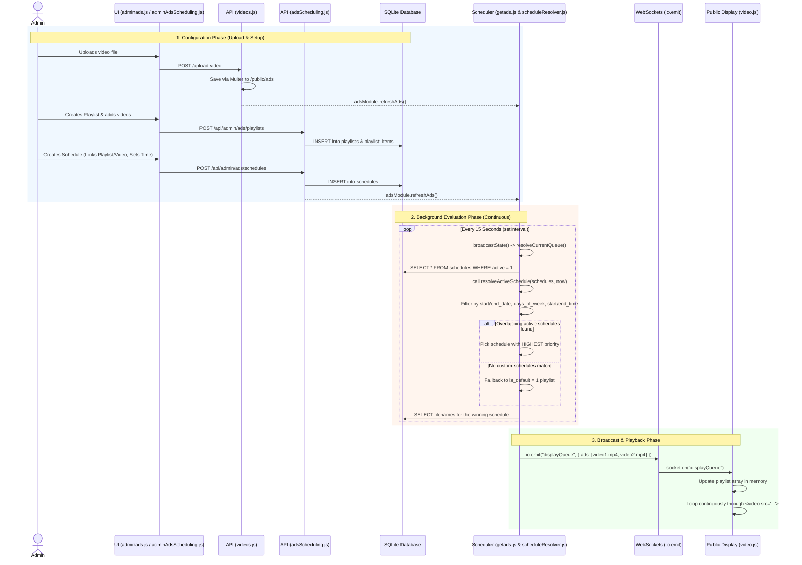

# Advertisement Scheduling and Playing Flow

This document details the configuration and operational flow of the OpenQ advertisement and announcement video system. It covers how videos are uploaded, organized into playlists, and scheduled for display.

## ⚙️ Core Components & Settings

The advertisement system is divided into four main areas:

### 1. Media Library
* **Purpose**: The central repository for all video files (`.mp4`, `.webm`, `.ogg`).
* **Flow**: Admins upload video files here. Every video must exist in the Media Library before it can be used in a playlist or schedule.
* **Control**: Admins can rename or delete files. Deleting a file automatically removes it from any playlists or schedules that depend on it.

### 2. Playlists
* **Purpose**: A sequence of specific videos grouped together to play in a predefined order.
* **Flow**: Admins create a playlist and assign videos from the Media Library into it.
* **Default Playlist**: One playlist is always marked as the "Default Playlist". The system automatically falls back to playing this sequence if no other custom schedules are currently active.

### 3. Schedules
* **Purpose**: Defines exactly **what** plays and **when** it plays.
* **Settings**:
  * **Name & Color**: Identifiers for the calendar view.
  * **Type**: A schedule can either play an entire `Playlist` or pin a single specific `Video`.
  * **Time Window**: Defined by `start_time` and `end_time` (e.g., 09:00 to 12:00). Supports overnight wrapping (e.g., 22:00 to 02:00).
  * **Date Range** *(Optional)*: Specific `start_date` and `end_date` bounds for seasonal/promotional campaigns.
  * **Days of Week** *(Optional)*: Limits the schedule to only run on certain days (e.g., Weekends only).
  * **Priority**: When multiple schedules overlap on the same time and day, the schedule with the highest priority wins. If priorities tie, a pinned `video` overrides a `playlist`.
  * **Active Toggle**: Quickly enable or disable a schedule without deleting it.

### 4. Display System
* **Purpose**: The public-facing interface (`/display`) that loops the advertisement videos between queue calls.
* **Flow**: Receives real-time websocket pushes (`displayQueue`) from the backend whenever the active schedule changes, and dynamically updates its video player loop.

---

## 🔄 Detailed System Architecture & Flow Diagram

### 1. High-Level Arrow Flow (with Files & Functions)

**1. Upload Video:**
`public/js/admin/adminads.js` ➔ `fetch('/upload-video')` ➔ `backend/routes/videos.js` (Multer saves to `/public/ads`) ➔ `adsModule.refreshAds()`

**2. Create Playlist:**
`public/js/admin/adminAdsScheduling.js` ➔ `fetch('/api/admin/ads/playlists')` ➔ `backend/routes/adsScheduling.js` ➔ Inserts into DB (`playlists`, `playlist_items`)

**3. Create Schedule:**
`public/js/admin/adminAdsScheduling.js` ➔ `fetch('/api/admin/ads/schedules')` ➔ `backend/routes/adsScheduling.js` ➔ Inserts into DB (`schedules`) ➔ `adsModule.refreshAds()`

**4. Backend Engine (Every 15s):**
`backend/routes/getads.js` (`setInterval`) ➔ `broadcastState()` ➔ `resolveCurrentQueue()` ➔ `backend/utilities/scheduleResolver.js` (`resolveActiveSchedule(schedules, now)`) ➔ Priority Check ➔ Returns Winner

**5. Display Playback:**
`backend/routes/getads.js` ➔ `io.emit("displayQueue")` ➔ `public/js/display/video.js` / `indexSocket.js` ➔ Updates `<video>` loop logic

---

### 2. Detailed Sequence Diagram

## 📝 Backend Scheduling Logic (`scheduleResolver.js`)

The core decision-making algorithm (`resolveActiveSchedule`) runs as follows:

1. **Filter Candidates**: It scans all schedules in the database and discards any that are:
   * Marked as inactive.
   * Outside their designated date range (`start_date` -> `end_date`).
   * Not scheduled for today's day of the week.
   * Outside their daily time window (`start_time` -> `end_time`).
2. **Determine Winner**: If multiple schedules survive the filter (i.e., they overlap), it sorts them by `priority` (highest number wins).
3. **Tie-Breaker**: If priorities are identical, a schedule of type `video` beats a schedule of type `playlist`.
4. **Broadcast**: The backend fetches the required video filenames for the winning schedule, compares them against what physically exists on disk, and sends the verified array of filenames to the display screens.
